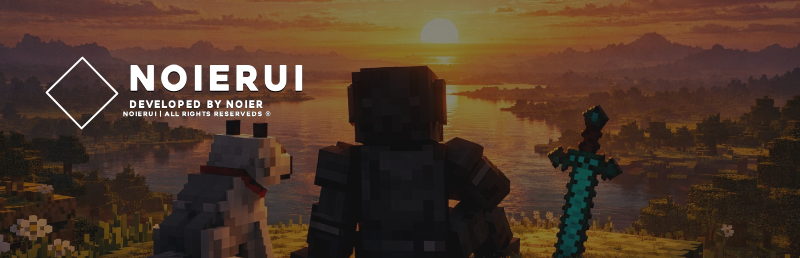

  

<h1 align="center">NoierUi</h1>

  
  
  
  
  
  
  
  

---

> [!IMPORTANT]
> This project is not affiliated with Mojang.
> Noier Projects is not responsible for any misuse of this project.

---

## 🔹 About the Project

**NoierUi** is a Brazilian project focused mainly on **Minecraft Bedrock Edition**.

It is still in active development, constantly improving layout structure, animation systems and visual refinement.

This entire project was built **100% on a mobile device**.

AI was used only to assist in JSON structure generation.
All layout logic, visual design, alignment system and structure were created manually.

As the creator, I do **not** recommend relying 100% on AI for development, since it can make repeated technical mistakes.
Understanding what you're building is essential.

---

## 🔹 How to Use

Download the pack directly from **CurseForge** or **MCPEDL**, export it to Minecraft Bedrock and activate it in-game. After activation, it is recommended to **restart the game**.

---

## 🔹 Compatibility

- Compatible with any version from **v26+**
- Compatible with any **mid to high-end device** — lag may occur on low-end devices

---

## 🔹 Download

  
  &nbsp;
  

---

## 🔹 License

> © Noier_x7 — All Rights Reserved
> Developed by Noier Projects

For full terms of use, download the terms file below:

📄 **[Terms of Use (.txt)](./TERMS_EN.txt)**

---

  NoierUi — Developed by Noier Projects © 2026

